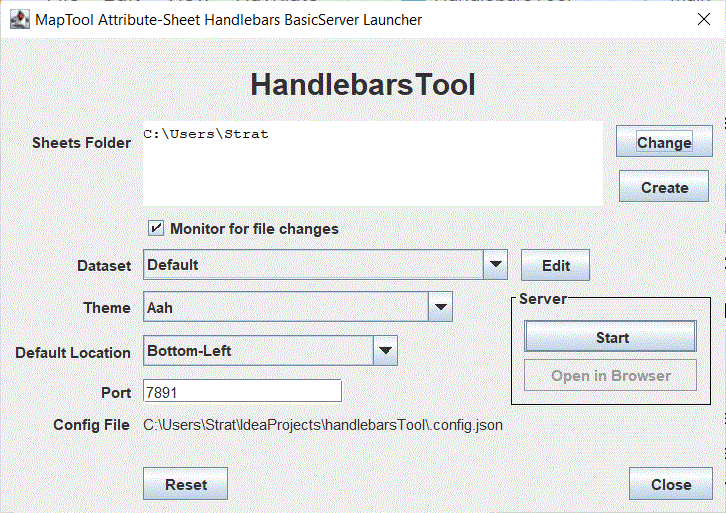
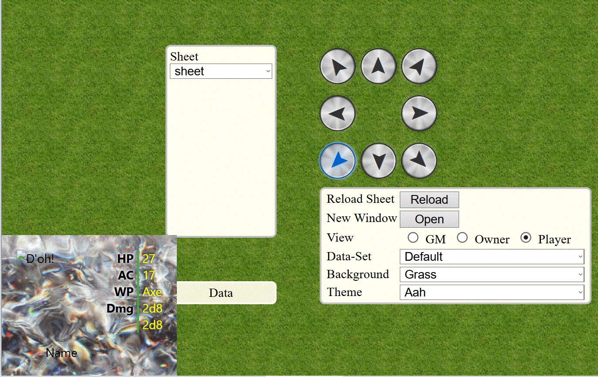

A stand-alone tool for developing Handlebars templates for use with MapTool

<!DOCTYPE html>
<html lang="en-AU">
<head>
    <meta charset="UTF-8" />
    <meta name="viewport" content="width=device-width, height=device-height, user-scalable=0, initial-scale=1" />
</head>
<body>
<h1>HandlebarsTool</h1>
<h2>What it is</h2>

A tool that runs a local HTTP server for delivering <a href="https://handlebarsjs.com">Handlebars</a> templated content. Specifically, for delivering Handlebars templates using <a href="https://www.rptools.net/toolbox/maptool/">MapTool</a> token data to assist in developing attribute sheets and similar content.

<h2>Using it</h2>

You should be presented with a window like this at launch.

<h3>Useful Bits</h3>
<dl>
    <dt>Templates Folder</dt>
    <dd>This is the directory containing templates to be displayed.
        <ul><li>Click the path displayed to open the folder.</li>
            <li>Choose a different folder with the "Change" button.</li>
            <li>Generate a whole new folder structure at your desired location with the "Create" button.</li>
        </ul>
    </dd>
    <dt>Monitor for file changes</dt>
    <dd>
        When selected, if it works, any files saved in the folder and subdirectories will cause the template to be refreshed to incorporate any changes.
    </dd>
    <dt>Dataset, i.e. mock Token Property Type</dt>
    <dd>
        The default set of data used for generating templates. You will probably set it once and never need it again.
    </dd>
    <dt>The "Edit" button</dt>
    <dd>Used for creating and changing datasets.</dd>
    <dt>Theme</dt>
    <dd>Which theme to use when delivering templates at start.</dd>
    <dt>Default Location</dt>
    <dd>Where to display the templates at start.</dd>
    <dt>Port</dt>
    <dd>Which port the main server will run on.</dd>
    <dt>Config file</dt>
    <dd>Displays the path to the ".config.json" file. Click the path to open.</dd>
    <dt>Reset</dt>
    <dd>Kill the config file. Return everything to default.</dd>
    <dt>Start</dt>
    <dd>Start the server</dd>
    <dt>Open in Browser</dt>
    <dd>Opens the main viewing page in your browser.</dd>
</dl>
<h2>The Browser View</h2>

bored now
</body>
